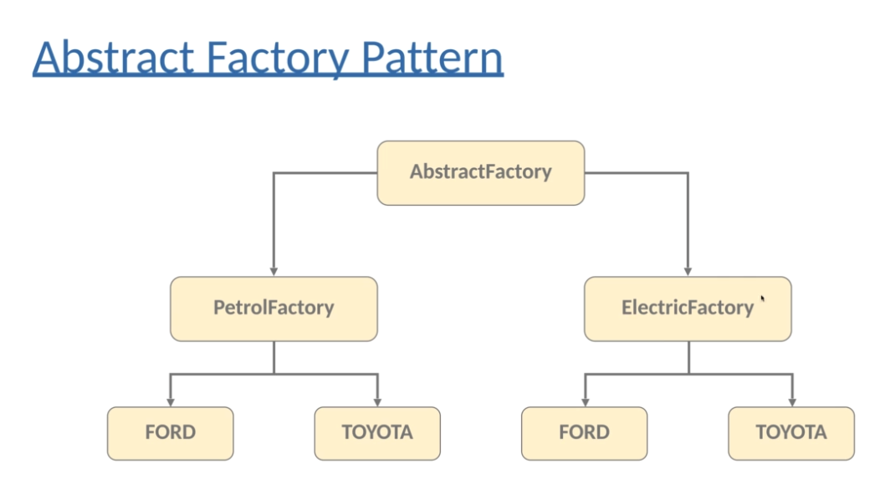

# Abstract Factory

Creates a correspondance between the hierarchy of objects you have, and the hierarchy of factories.

Factories that creates other factories. (In our example FactoryProducer.java)

It is an interface that is responsible of creating a factory of related objects *without explicitly specifying their clases*.

Example: We have a PetrolFactory and a ElectricFactory for differnt types of cars

